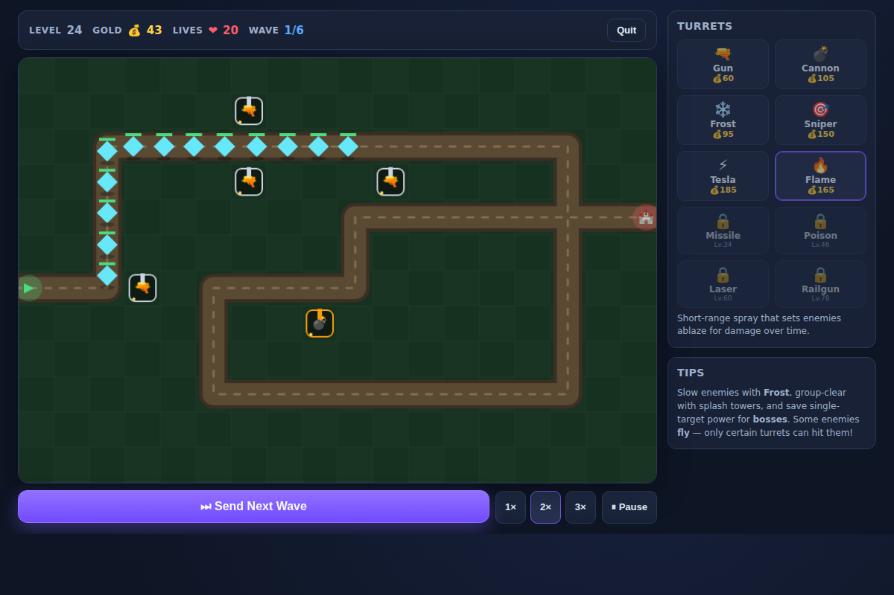

# Turret Defense King 👑

An original, browser-based **tower defense** game with **100 escalating levels**,
unlockable turrets, and boss fights. No build step, no downloads — just open
`index.html` and play.



## Play

Open `index.html` in any modern browser (Chrome, Firefox, Safari, Edge).
That's it — everything is pure HTML5 Canvas + vanilla JavaScript, no server required.

To serve it locally instead (optional):

```bash
python3 -m http.server 8000
# then visit http://localhost:8000
```

## How it works

- **Goal:** Stop every enemy from reaching your base. Each leak costs lives — run out and the level is lost.
- **Build:** Pick a turret from the sidebar, then click a grassy tile to place it (costs gold).
- **Earn:** Every kill pays gold; clearing a wave pays a bonus; sending waves early pays extra.
- **Upgrade / Sell:** Click a placed turret to upgrade it (up to **Lv. 4**) or sell it for a refund.
- **Speed & Pause:** Toggle `1×` / `2×` / `3×` and pause with the buttons or keys `1`/`2`/`3`/`Space`.
- **Progress is saved** to `localStorage`, including your best star rating (★★★ = no lives lost) per level.

## Progression

- **100 levels** across 6 hand-built maps, cycling as you climb.
- Difficulty scales continuously: enemy **health, speed, count, and wave depth** all grow with the level number.
- **Boss levels** every 10th level throw a crowned juggernaut at your defenses.
- **New turrets unlock** as you reach milestone levels — you win the level, you earn the tech.

## Enemies

Grunts, fast Runners, tiny Swarms, armored Tanks, **Flyers** (only air-capable
turrets can hit them), self-healing Healers, heavily **Armored** units, and **Bosses**.

## The arsenal (unlocked as you progress)

| Turret | Unlock | Role |
| --- | --- | --- |
| 🔫 Gun | Lv. 1 | Cheap, rapid single-target fire |
| 💣 Cannon | Lv. 1 | Slow, heavy splash damage |
| ❄️ Frost | Lv. 4 | Slows enemies (hits air) |
| 🎯 Sniper | Lv. 9 | Long range, huge single-target hits (air) |
| ⚡ Tesla | Lv. 16 | Chain lightning between enemies (air) |
| 🔥 Flame | Lv. 24 | Short-range spray + burn damage-over-time |
| 🚀 Missile | Lv. 34 | Big splash, homing, hits air |
| ☠️ Poison | Lv. 46 | Stacking poison that ignores armor (air) |
| 🔆 Laser | Lv. 60 | Continuous beam that ramps up damage (air) |
| 🛰️ Railgun | Lv. 78 | Piercing hyper-shot through a whole line (air) |

## Files

- `index.html` — page structure & UI
- `style.css` — styling
- `game.js` — the full game engine (maps, waves, towers, enemies, rendering, input, save/progress)

Everything is self-contained and dependency-free.
